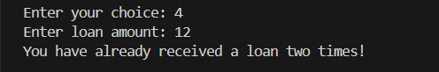

# Bank Management System

This is a simple Python-based Bank Management System designed to simulate the core operations of a bank, including account creation, balance management, loan processing, and money transfer, also includes an admin panel for managing accounts and viewing financial statistics.

### Admin Panel:
- *Create and Delete Account*
- *View All Accounts*
- **heck Total Available Balance*
- *Check Total Loan Amount*
- *Toggle Loan Feature*
### Account Holder Panel:
- *Check Balance* 
- *Deposit Money*
- *Withdraw Money*
- *Get Loan*
- *Transfer Money*
- *View Transaction History*

## Running Step by Step
The very first interface,,first choose admin to create and delete account for users.

admin view all account holders

Then the user can access their account

user can check their available money

User can deposit and withdraw money
 

user can get loan but at most 2 times 

Can transfer money to any other account

user can view all the transaction history

For admin part, admin can view available balance and total loans

admin can turned off loan feature so no user can get any loan from bank

