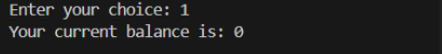
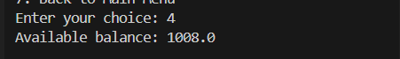

# Bank Management System

This is a simple Python-based **Bank Management System** designed to simulate the core operations of a bank, including account creation, balance management, loan processing, and money transfer. It also includes an admin panel for managing accounts and viewing financial statistics.

---

### Admin Panel:
- *Create and Delete Account*
- *View All Accounts*
- *Check Total Available Balance*
- *Check Total Loan Amount*
- *Toggle Loan Feature*

### Account Holder Panel:
- *Check Balance*
- *Deposit Money*
- *Withdraw Money*
- *Get Loan*
- *Transfer Money*
- *View Transaction History*

---

## Running Step by Step

**The very first interface, first choose admin to create and delete accounts for users.**

**Admin can view all account holders:  **

**Example of account deletion:**  

---

**Then the user can access their account:**  

**Users can check their available money:**  

---

**Users can deposit and withdraw money: ** 
- **Deposit Money:**  
  
  
- ***Withdraw Money:  ***
  

---

**Users can get a loan but at most 2 times:**  

---

**Users can transfer money to any other account:**  

---

**Users can view their transaction history:**  

---

### Admin Features:

**Admins can view the available balance and total loans:**  
  

**Admins can turn off the loan feature, so no user can get any loans from the bank:**  

